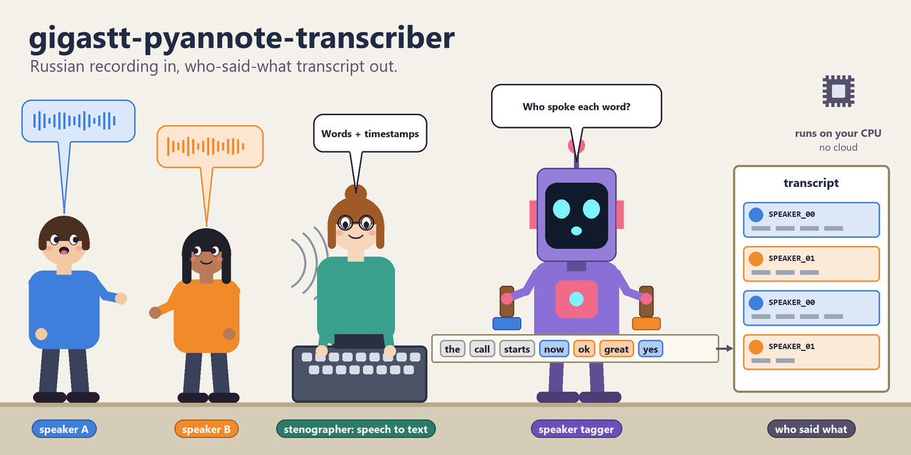
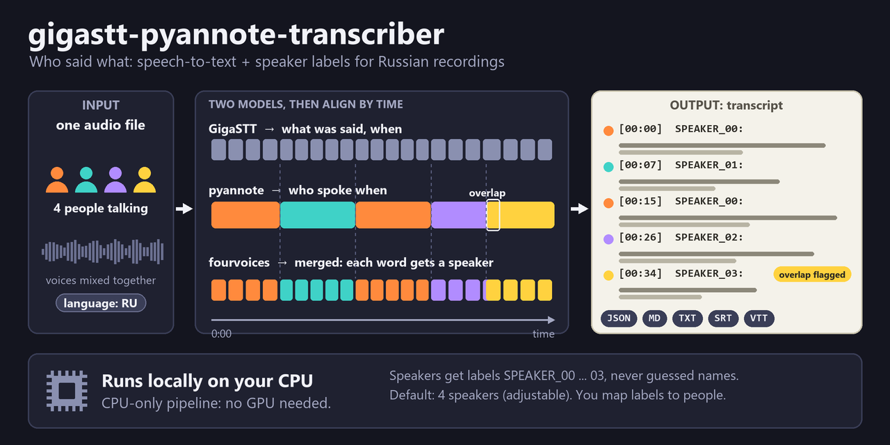

<p align="center"></p>
<h1 align="center">gigastt-pyannote-transcriber</h1>
<p align="center"><b>Запись на русском на входе — транскрипт «кто что сказал» на выходе: локальный CPU-конвейер (GigaSTT + pyannote) для разговоров нескольких людей, которые придётся цитировать и сверять на слух.</b></p>
<p align="center">
  <a href="pyproject.toml"></a>
  <a href="#требования"></a>
  <a href="#требования"></a>
  <a href="pyproject.toml"></a>
  <a href="https://github.com/AndrewMoryakov/gigastt-pyannote-transcriber/actions/workflows/tests.yml"></a>
</p>
<p align="center"><a href="README.md">English</a> | <b>Русский</b></p>

```powershell
.\scripts\run.ps1 -InputAudio '.\media\запись.m4a'   # -> transcript.{md,txt,srt,vtt,json}
```

**Fourvoices: GigaSTT + pyannote для четырёх голосов.** Локальный CPU-конвейер для русскоязычных записей: **GigaSTT 2.21.0 / GigaAM v3 RNNT** распознаёт слова и их время, **pyannote Community-1** определяет, кто и когда говорил, а Python-пакет `fourvoices` совмещает результаты по времени. (Пакет и CLI называются `fourvoices`, репозиторий — `gigastt-pyannote-transcriber`.) Исходное аудио, модели, токены и результаты намеренно исключены из Git.

*Основная версия документации — английская: [README.md](README.md). Этот файл поддерживается как перевод; при расхождении верным считается английский.*

## Зачем нужен gigastt-pyannote-transcriber?

- **Если** у вас есть запись разговора нескольких людей на русском (интервью, встреча, звонок) и нужно знать, **кто что сказал**, **то** из одного аудиофайла получится транскрипт с подписью говорящего у каждой реплики.
- **Если** хочется обрабатывать всё на своей машине и без GPU, **то** это CPU-конвейер для Windows 10/11 x64; подойдёт любой процессор, на слабом будет просто медленнее.
- **Если** результат придётся цитировать и сверять на слух, **то** здесь сохраняются настоящие пословные тайминги, перекрытия речи и сомнительная атрибуция помечаются, а не прячутся, имена людей не угадываются, исполняемый файл GigaSTT зафиксирован по URL + SHA-256, а модель pyannote — по git-ревизии.
- **Если** не хочется зря тратить часы на повторный запуск, **то** готовые этапы подхватываются с диска, а изменённые настройки останавливают запуск, а не смешиваются молча.

**Честные оговорки.** Конвейер рассчитан на разговор четырёх человек, записанный одним микрофоном (по умолчанию `num_speakers: 4`; чтобы изменить — например, `-NumSpeakers 3`). Нужна **учётная запись Hugging Face и read-токен**: модель pyannote gated, и `HF_TOKEN` требуется при каждой транскрибации, а не только при скачивании. Первая установка требует сети и около 10 ГБ. Это не облачный сервис и не GPU-конвейер (зафиксированная сборка PyTorch — только CPU). Автоматическая транскрипция не является дословной гарантией — см. замечание в конце.

Сами транскрипты русские, поэтому пометки внутри них (`перекрытие речи`, `спикер под вопросом`) тоже русские. Этот документ — справочник по работе с конвейером, а не описание языка вывода.

## Возможности

- **Слова с таймингами, затем говорящие** — GigaSTT (RNNT) даёт пословные метки времени, pyannote строит exclusive-диаризацию, каждому слову по времени назначается говорящий.
- **Пять форматов вывода** — JSON, Markdown, обычный текст, SRT и VTT за один запуск; субтитры режутся по границам слов с настоящими таймингами.
- **Честная неуверенность** — `[перекрытие речи]` для одновременной речи и `[спикер под вопросом]` для сомнительной атрибуции показывают, где стоит переслушать.
- **Две копии звука из одного исходника** — почти исходная для диаризации и мягко отфильтрованная для распознавания; оригинал не изменяется.
- **Возобновляемые и воспроизводимые задания** — манифест подтверждает каждый готовый этап; изменение параметра, влияющего на результат, требует `--force`.
- **Имена вручную** — заполните карту говорящих после прослушивания и пересоберите вывод без всякого инференса.
- **Закреплено, где возможно** — исполняемый файл GigaSTT по URL и SHA-256 (а сам GigaSTT сверяет веса GigaAM RNNT, пунктуации и VAD с вшитыми в него SHA-256), pyannote по полному git revision; этапы распознавания и диаризации запоминают версии программ, которыми посчитаны; проверки гигиены репозитория не пускают в Git аудио, токены и модели.

## Как это работает

<p align="center">
  
</p>

1. **Две копии звука.** Из одной записи получаются почти исходная mono-копия 16 кГц для диаризации и мягко отфильтрованная копия для распознавания.
2. **Распознавание слов.** GigaSTT (RNNT) выдаёт слова с началом и концом.
3. **Поиск говорящих.** pyannote Community-1 получает `num_speakers=4` и строит exclusive-диаризацию.
4. **Совмещение по времени.** `fourvoices` назначает каждому слову говорящего, помечает перекрытия и сомнительную атрибуцию и сохраняет транскрипт в пяти форматах.
5. **Имена назначаете вы.** Прослушайте длинные реплики каждого кластера, заполните карту говорящих и пересоберите вывод — подписи никогда не превращаются в имена автоматически.

## Быстрый старт

Краткая версия; каждый шаг разобран в [порядке запуска](#порядок-запуска-коротко) и в [подробной настройке Windows](#быстрый-старт-на-чистой-windows) ниже. Сначала примите условия gated-модели pyannote на Hugging Face и создайте read-токен (см. [Однократный доступ](#однократный-доступ-к-gated-модели-hugging-face)).

```powershell
Set-ExecutionPolicy -Scope Process Bypass
.\scripts\install.ps1 -InstallFfmpeg

# Токен живёт только в текущем PowerShell и не записывается на диск:
$secureToken = Read-Host 'HF read token' -AsSecureString
$env:HF_TOKEN = [Net.NetworkCredential]::new('', $secureToken).Password

.\scripts\download-models.ps1       # нужна сеть, ~10 ГБ
.\scripts\doctor.ps1                # все строки должны быть [OK]

# положите записи в .\media\, затем:
.\scripts\run.ps1 -InputAudio '.\media\запись.m4a'
```

Результаты появятся в `..\gigastt-pyannote-output\<задание>\` — в соседнем с репозиторием каталоге, откуда они не могут случайно попасть в commit.

## Порядок запуска, коротко

Полная последовательность от чистой машины до готового транскрипта. Каждый шаг
подробно разобран ниже.

| # | Шаг | Когда |
|---|-----|-------|
| 1 | Принять условия модели на Hugging Face и создать read-токен | один раз |
| 2 | `.\scripts\install.ps1 -InstallFfmpeg` | один раз |
| 3 | Задать `$env:HF_TOKEN` | в каждом новом окне PowerShell |
| 4 | `.\scripts\download-models.ps1` | один раз, нужна сеть, ~10 ГБ |
| 5 | `.\scripts\doctor.ps1` — все строки должны быть `[OK]` | после установки |
| 6 | `.\scripts\test.ps1` — линтер, тесты, гигиена репозитория | по желанию |
| 7 | Положить записи в `.\media\` | перед работой |
| 8 | `.\scripts\run.ps1 -InputAudio '.\media\запись.m4a'` | каждая запись |
| 9 | Прослушать кластеры, заполнить speaker-map, `.\scripts\rerender.ps1` | после прогона |

**`HF_TOKEN` нужен не только для скачивания, но и при каждой транскрибации:**
диаризация отказывается стартовать без него, даже когда все веса уже лежат на
диске. Если удалить токен из окружения после установки, шаг 8 остановится с
`error: Set HF_TOKEN...`. Либо задавайте токен в каждом новом окне PowerShell,
либо один раз положите его в локальный `.env` (файл игнорируется Git).

## Требования

- Windows 10/11 x64, **любой** процессор — CPU-only. Примеры времени
  обработки приведены для Ryzen 9 7950X, но требованием он не является: на
  более слабой машине будет медленнее, и только;
- PowerShell 5.1 или 7;
- около 10 ГБ свободного места на установку, модели и промежуточные WAV;
- ОЗУ: аудио целиком загружается в память при диаризации, примерно 230 МБ на
  час записи плюс сама модель. Для записей в час-полтора 16 ГБ хватает с
  запасом;
- стабильный интернет для первой установки;
- учётная запись Hugging Face и read-токен.

Python 3.11 и виртуальная среда управляются через
[uv](https://docs.astral.sh/uv/). PyTorch зафиксирован на CPU-сборке
`2.11.0+cpu`; CUDA не требуется и этой сборкой не поддерживается.

## Однократный доступ к gated-модели Hugging Face

До запуска скачивания:

1. Войдите на Hugging Face.
2. Откройте
   <https://huggingface.co/pyannote/speaker-diarization-community-1>,
   прочитайте и примите условия доступа.
3. Создайте **Read** token на <https://huggingface.co/settings/tokens>.
4. Не публикуйте токен, не вставляйте его в issue/commit/log.

Ревизия модели зафиксирована:
`3533c8cf8e369892e6b79ff1bf80f7b0286a54ee`.

## Быстрый старт на чистой Windows

Перенесите репозиторий на машину (`git clone`, если он где-то опубликован,
иначе просто скопируйте каталог). Каталоги `.venv`, `models`, `tools\bin` и
`tools\downloads` копировать не нужно и не следует: в `.venv` записаны
абсолютные пути исходной машины, остальное восстановят скрипты установки.

```powershell
Set-Location .\gigastt-pyannote-transcriber
Set-ExecutionPolicy -Scope Process Bypass

# uv, Python 3.11, .venv и CPU-зависимости; при необходимости также ffmpeg:
.\scripts\install.ps1 -InstallFfmpeg

# Токен живёт только в текущем PowerShell и не записывается на диск:
$secureToken = Read-Host 'HF read token' -AsSecureString
$env:HF_TOKEN = [Net.NetworkCredential]::new('', $secureToken).Password
```

Если ffmpeg был установлен через winget и ещё не виден в `PATH`, откройте
новое окно PowerShell, вернитесь в каталог репозитория и снова задайте токен
командами выше. Затем выполните:

```powershell
Set-ExecutionPolicy -Scope Process Bypass
.\scripts\download-models.ps1
.\scripts\doctor.ps1
.\scripts\test.ps1
```

Токен на этом шаге **не удаляйте**: он понадобится и при самой транскрибации.
Удалять его имеет смысл только когда работа на сегодня закончена
(`Remove-Item Env:HF_TOKEN`), помня, что в следующем окне PowerShell его
придётся задать снова.

`download-models.ps1` скачивает строго GigaSTT **v2.21.0** для Windows x64,
проверяет архив по SHA-256 из `tools/tools.lock.json`, затем получает RNNT INT8,
VAD, пунктуацию и точную ревизию pyannote. Непроверенный `gigastt.exe` не
запускается.

Положите записи в игнорируемый каталог `media`:

```powershell
Copy-Item 'D:\Аудио\беседа-1.m4a' .\media\
Copy-Item 'D:\Аудио\беседа-2.m4a' .\media\

.\scripts\run.ps1 -InputAudio @(
    '.\media\беседа-1.m4a',
    '.\media\беседа-2.m4a'
)
```

Если говорящих не четверо, укажите их число: `-NumSpeakers 3`.

Файлы обрабатываются **строго последовательно**, чтобы два тяжёлых CPU-задания
не конкурировали за память. Результаты по умолчанию появятся в соседнем с
репозиторием каталоге `gigastt-pyannote-output\`, то есть не смогут случайно
попасть в commit. Скрипт запрашивает четыре кластера говорящих, но имена людей
автоматически не угадывает.

Если pyannote нашёл другое число говорящих (например, один участник почти всё
время молчал), результат диаризации всё равно сохраняется, а в вывод попадает
предупреждение: терять десятки минут работы из-за такого расхождения нельзя.
Чтобы вместо предупреждения получать отказ, добавьте `-StrictSpeakers` —
результат при этом тоже останется на диске.

Если запись стереофоническая, программа сначала остановится, не смешивая
каналы молча. Прослушайте левый и правый каналы отдельно. Если полезного
пространственного разделения нет, повторите команду с `-AllowDownmix`.

## Что лежит в каталоге задания

Имя задания — это очищенное имя файла плюс первые 12 символов SHA-256
исходного аудио, поэтому две разные записи никогда не попадут в один каталог.

```
<имя>-<хэш>/
  manifest.json          что и когда посчитано, с какими параметрами
  audio/asr.wav          копия для распознавания (с фильтром)
  audio/diarization.wav  копия для диаризации (без фильтра)
  intermediate/gigastt.json    слова и их время
  intermediate/gigastt.log     журнал GigaSTT за этот прогон
  intermediate/pyannote.json   сегменты говорящих
  intermediate/merged.json     совмещённый результат
  transcript.{md,txt,srt,vtt,json}
```

Распознавание и диаризация занимают на CPU минуты на час записи, поэтому
обе стадии примерно раз в полминуты сообщают о ходе работы: распознавание
считает обработанные окна (с VAD их число заранее неизвестно, поэтому это не
проценты) и в конце пишет скорость, диаризация называет текущий шаг pyannote и
его долю. Это обычные строки, они читаются и в перенаправленном журнале.

Повторный запуск той же команды не пересчитывает готовые этапы: они берутся из
`intermediate/`, но только если записаны в `manifest.json`. Поэтому потерянный
или повреждённый манифест приводит к честному пересчёту, а не к транскрипту,
склеенному из результатов с разными настройками.

Если изменить параметр, влияющий на результат (число говорящих, фильтры,
пороги слияния, вариант модели), запуск остановится с требованием `--force`:
молча смешивать старые и новые этапы нельзя. Число потоков PyTorch на результат
не влияет и пересчёта не требует. Прерванный запуск (Ctrl+C) продолжается с
последнего **завершённого** этапа: этап, прерванный на середине, считается
непосчитанным и выполняется заново целиком.

Этапы распознавания и диаризации также запоминают, какими программами они
посчитаны. Новый релиз GigaSTT меняет сами слова и их время, поэтому если
запускаемый GigaSTT (`run.ps1` всегда запускает закреплённый в
`tools/tools.lock.json`) отличается от записанного в задании (или версия не записана — так у заданий,
сделанных до появления этой проверки), заново выполняется только
распознавание и всё, что на нём построено; диаризация сохраняется. Другая
версия `pyannote.audio` или `torch` лишь выводит предупреждение: модель
закреплена ревизией, а диаризация — самый дорогой этап; для пересчёта
используйте `--force`. Если распознавание или диаризация пересчитаны,
совмещённый результат строится заново, а не берётся из прошлого запуска.

Некоторые проблемы GigaSTT сообщает только в своём журнале, завершаясь при
этом успешно, поэтому его предупреждения дублируются на экран, а сам журнал
сохраняется в `intermediate/`. Одна такая проблема проверяется явно: если
пунктуация запрошена, а длинный текст пришёл без единого знака препинания,
запуск предупреждает об этом, а манифест помечает
`punctuation_missing: true`.

Менять оформление можно без всякого инференса — командой `render`: она
перечитывает `merged.json`. Лимиты субтитров и пометки неуверенности она
берёт те, с которыми задание отрисовывалось в последний раз, если не передан
флаг (у заданий, отрисованных до появления этой записи, — значения по
умолчанию). Команда откажется работать, если манифест больше не ручается за
`merged.json`: так бывает, когда прерван запуск, пересчитавший распознавание
или диаризацию, до пересборки результата; сначала завершите этот запуск.

## Назначение говорящих вручную

После первого прохода прослушайте несколько длинных реплик каждого кластера.
Скопируйте карту и замените подписи:

```powershell
Copy-Item .\config\speaker-map.example.yaml `
    ..\gigastt-pyannote-output\<имя-задания>\speaker-map.yaml
notepad ..\gigastt-pyannote-output\<имя-задания>\speaker-map.yaml

.\scripts\rerender.ps1 `
    -JobDir ..\gigastt-pyannote-output\<имя-задания> `
    -SpeakerMap ..\gigastt-pyannote-output\<имя-задания>\speaker-map.yaml
```

Не назначайте имя по короткому «да/угу»: для проверки используйте длинные,
хорошо слышимые фрагменты. Подпись, которой нет в транскрипте, никого не
переименует, и запуск сообщает об этом, а не делает вид, что замена сработала.
Перебивания и одновременная речь требуют ручной
вычитки независимо от модели.

## Оценка качества на своих записях

Автоматическую расшифровку нужно с чем-то сверять. `evaluate` сравнивает
готовое задание с эталоном, которому вы доверяете, и выдаёт два числа:

- **WER** — доля слов эталона, которые заменены, пропущены или вставлены
  лишними, после приведения к нижнему регистру, замены `ё` на `е` и удаления
  знаков препинания;
- **точность атрибуции** — среди слов, которые есть в обоих текстах, доля
  отданных правильному человеку. Кластеры сопоставляются с именами эталона
  один к одному так, чтобы совпадение было наибольшим; `UNKNOWN` не
  сопоставляется никогда и всегда считается ошибкой.

Эталон — текстовый файл в формате `transcript.txt`: одна реплика на строку,
`[чч:мм:сс–чч:мм:сс] Имя: текст`. Время необязательно, пометки вроде
`[перекрытие речи]` игнорируются, строка без `Имя:` продолжает предыдущего
говорящего, строки с `#` — комментарии. Два часа вручную никто не
расшифровывает, поэтому эталон обычно покрывает фрагмент: оцениваются только
слова внутри его промежутка времени (или задайте `-Start`/`-End`).

```powershell
# Эталон: скопируйте транскрипт, оставьте фрагмент на несколько минут,
# прослушайте и исправьте в нём каждое слово и каждое имя.
Copy-Item ..\gigastt-pyannote-output\<задание>\transcript.txt .\media\reference.txt
notepad .\media\reference.txt

.\scripts\evaluate.ps1 ..\gigastt-pyannote-output\<задание> -Reference .\media\reference.txt
```

Результат пишется в `<задание>\evaluation.json` вместе со всеми местами, где
слова расходятся, и их временем в записи — понятно, что переслушать. Само
задание не изменяется.

Две оговорки:

- **Эталон, полученный правкой транскрипта, оптимистичен.** Ошибки, которые
  читаются естественно, легко пропустить, когда текст перед глазами. Для
  честной оценки наберите фрагмент с нуля, слушая запись.
- **Пишите числа так же, как транскрипт.** Нормализация превращает «двадцать
  три» в «23»; эталон, где число написано словами, засчитает это как ошибку.

Когда эталон есть, любое изменение — новый GigaSTT, другие фильтры, другое
число говорящих — можно оценивать цифрами, а не на слух.

## Как обрабатывается звук

- Для pyannote создаётся почти исходная версия: mono, 16 кГц, без агрессивного
  шумоподавления (`audio.diarization_filter`).
- Для ASR создаётся отдельная версия с мягким high-pass 80 Гц и loudnorm
  (`audio.asr_filter`).
- Стерео сначала следует прослушать по каналам: иногда левый/правый канал уже
  разделяет собеседников. Автоматическое downmix до такой проверки нежелательно.
- Оригинал не изменяется.

Базовые настройки находятся в `config/default.yaml`. Каждый ключ там реально
читается конвейером, а неизвестные ключи отвергаются с ошибкой — опечатка не
может молча выглядеть настройкой. Относительные пути в конфиге отсчитываются от
корня проекта (ближайший каталог с `pyproject.toml`), а не от текущего каталога.

## Почему параметры именно такие

Значения по умолчанию выбраны под одну задачу: разговор четырёх человек на
русском, записанный одним микрофоном, который потом придётся цитировать и
сверять на слух. Ниже — что стоит за каждым и что произойдёт, если сдвинуть.

### Два разных файла из одного исходника

`audio.diarization_filter: null` и
`audio.asr_filter: highpass=f=80,loudnorm=I=-18:LRA=11:TP=-2`.

Это ключевое решение всего конвейера. Распознаванию важна разборчивость,
диаризации — тембр. Нормализация громкости и шумоподавление меняют именно те
характеристики голоса, по которым кластеризуются говорящие, поэтому диаризация
получает звук максимально близкий к исходному: только моно и 16 кГц.

Копия для ASR чистится мягко. 80 Гц лежит ниже основного тона обычного
говорящего голоса, поэтому high-pass убирает гул, тряску стола и ветер, почти
не задевая речь. `loudnorm` приводит запись к предсказуемой громкости
(−18 LUFS), чтобы тихая и громкая записи распознавались одинаково. Сильнее
обрабатывать рискованно: чем агрессивнее фильтр, тем выше шанс потерять тихие
окончания слов и короткие реплики.

### Диаризация

`num_speakers: 4` — число говорящих задаётся, а не угадывается: при
фиксированном числе кластеризация воспроизводима от запуска к запуску. Если
pyannote нашёл другое количество, результат всё равно сохраняется и выводится
предупреждение.

`model` + `revision` — модель закреплена не только по имени, но и по ревизии.
Обновление на стороне Hugging Face не должно менять то, что сказал бы уже
выданный транскрипт. Конфигурация с другими значениями отвергается, а не
используется молча.

`device: cpu` — зафиксирована CPU-сборка PyTorch, CUDA в проекте нет.

**Почему Community-1, а не Precision.** Коммерческие модели pyannote
(`precision-2`, а с сентября 2026 года `precision-3` за тем же конвейером
`pyannote/speaker-diarization-precision`) заметно точнее: по собственным
замерам pyannote на записях совещаний вроде AMI и AliMeeting ошибка
диаризации около 15 % против 20 %. Но доступны они только через облачный API
pyannoteAI: конвейер из `pyannote.audio` загружает аудиофайл на серверы
pyannoteAI и требует платного ключа, весов для скачивания нет (самостоятельное
размещение предлагается только по корпоративным контрактам). Проект
существует ради того, чтобы записи не покидали машину, поэтому остаётся на
Community-1 — самой новой открытой модели — и не предлагает облачную модель
даже как опцию. По той же причине безусловно выключена телеметрия pyannote
(она отправляет длительность файла и число говорящих на `otel.pyannote.ai`).

### Распознавание

`model_variant: rnnt` — весь конвейер построен на пословных таймингах: без
массива `words` с началом и концом каждого слова слияние с диаризацией
невозможно, и распознавание завершится ошибкой. Менять вариант можно только на
такой, который тоже отдаёт word timestamps.

`punctuation: true`, `itn: true` — GigaSTT применяет пунктуацию и нормализацию
чисел только к сплошному тексту, оставляя `words[]` сырыми. Слияние переносит
обработанное написание обратно на слова с таймингами и только там, где
нормализованные формы совпадают точно: замена «двадцать три» → «23» откатывается
к сырому слову, а не выдумывает соответствие. Отключение стоит читаемости, но не
таймингов.

`vad: true` — детектор речи не пускает распознаватель в длинные паузы, где он
иначе волен придумать текст.

**Почему GigaSTT 2.21.0.** У ранее закреплённой версии 2.15.0 было два
дефекта, бьющих ровно по тем записям, для которых сделан конвейер; оба
исправлены в 2.16.0 и оба воспроизведены здесь на настоящей русской речи.
Когда текст перерастал окно модели пунктуации в 2048 токенов (запись на
28 минут, 1 574 слова), пунктуация молча пропадала: код возврата 0, текст в
нижнем регистре без единого знака. А с `--vad` всё длиннее 30 минут
отвергалось целиком. 2.21.0 декодирует файлы ограниченными окнами без
потолка по длительности (проверено сквозным прогоном 36-минутной записи),
расставляет пунктуацию в длинных текстах перекрывающимися окнами и при каждой
загрузке сверяет веса распознавателя с закреплёнными SHA-256. Все флаги,
которые передаёт проект, работают как прежде, а на одном и том же аудио сырые
слова различаются в единицах на тысячу. Задания, сделанные на 2.15.0, при
следующем запуске будут распознаны заново автоматически (см.
[Что лежит в каталоге задания](#что-лежит-в-каталоге-задания)).

### Слияние

`max_turn_gap: 1.5` — пауза внутри речи одного человека, после которой реплика
делится надвое. Значение выбрано с запасом относительно обычных пауз между
фразами, чтобы реплика не рвалась на вдохе. Уменьшите, если нужны более дробные
реплики; увеличьте, если собеседник говорит с длинными раздумьями.

`nearest_max_gap: 0.5` — насколько далеко слово может отстоять от ближайшего
exclusive-сегмента, прежде чем его говорящий станет `UNKNOWN`. Больше значение —
меньше `UNKNOWN`, но больше догадок; меньше — больше честно неатрибутированных
слов. Такие слова попадают в пометку «спикер под вопросом».

### Вывод

`mark_uncertain_words: true` — реплика помечается, если минимум половина её слов
привязана к говорящему без подтверждённого перекрытия. Один осторожный переход в
длинной фразе — норма, половина — повод переслушать.

`subtitle_max_seconds: 6`, `subtitle_max_chars: 84` — примерно две строки по
42 символа на несколько секунд экрана. Реплика в разговоре длится минуты, и без
нарезки субтитры нечитаемы.

### Потоки

`-TorchThreads` по умолчанию равен числу логических процессоров машины
(`os.cpu_count()`), поэтому репозиторий ведёт себя разумно на любом железе без
правки. Важно: считаются именно **логические** процессоры — на Ryzen 9 7950X
это 32, а не 16 физических ядер. Декодирование упирается в пропускную
способность памяти, и SMT здесь часто не помогает, а мешает, так что если
нужно число физических ядер — задайте его явно: `-TorchThreads 16`.

`-TorchInteropThreads` по умолчанию 1: ограничивает межоперационный
параллелизм, чтобы потоки не конкурировали за одни ядра. Учтите: PyTorch
принимает эту настройку только до первой параллельной операции, поэтому она
применяется по возможности и может тихо не сработать — на корректность
результата это не влияет.

В конфиге этих ключей нет намеренно: на результат они не влияют, живут только
в командной строке и пересчёта задания не требуют. В `run.ps1` значение `0`
означает «пусть fourvoices решает сам».

## Что помечается в транскрипте

- `[перекрытие речи]` — по regular-диаризации в этом интервале говорят двое.
- `[спикер под вопросом]` — минимум половина слов реплики привязана к
  говорящему без подтверждённого exclusive-перекрытия (ближайший сегмент,
  ничья между двумя спикерами или полное отсутствие сегмента).

Отключается ключом `output.mark_uncertain_words` или флагом
`--no-mark-uncertain` у команды `render`, а включается обратно флагом
`--mark-uncertain`. Обе пометки — повод переслушать
фрагмент, а не признак ошибки.

## Субтитры

Реплика в разговоре может длиться минуты, поэтому в SRT и VTT она режется на
отдельные cue по границам слов: тайминги остаются настоящими, а не
рассчитанными пропорционально. По умолчанию не длиннее 6 секунд и 84 символов
(две строки по 42), имя говорящего повторяется в каждом cue.

Пределы задаются ключами `output.subtitle_max_seconds` и
`output.subtitle_max_chars` либо флагами `--subtitle-max-seconds` /
`--subtitle-max-chars` у команды `render`; `0` отключает соответствующий
предел. Если в `merged.json` нет пословных таймингов, реплика остаётся одним
cue — неверная временная метка хуже длинного субтитра.

## Полезные команды

```powershell
# Проверка среды, токена, моделей и CPU PyTorch
.\scripts\doctor.ps1

# Линтер, тесты и защита от случайного добавления аудио/токенов
.\scripts\test.ps1

# Только повторное скачивание/проверка GigaSTT
.\scripts\download-models.ps1 -SkipPyannote -Force

# Только gated-модель pyannote
.\scripts\download-models.ps1 -SkipGigaStt

# Оценка задания по эталонному фрагменту, проверенному на слух
.\scripts\evaluate.ps1 <каталог-задания> -Reference reference.txt
```

## Безопасность и воспроизводимость

- Никогда не используйте `git add -f` для аудио, `.env`, `models\` или
  `transcripts\`.
- Перед commit запускайте `.\scripts\check-repo-hygiene.ps1`.
- Рекомендуется задавать `HF_TOKEN` только для текущего процесса PowerShell.
  Локальный `.env` поддерживается как запасной вариант и игнорируется Git.
- Исполняемый файл GigaSTT зафиксирован URL + SHA-256, pyannote — полным git revision. Веса GigaAM RNNT, пунктуации и VAD скачивает сам `gigastt` и сверяет их с SHA-256, вшитыми в закреплённый исполняемый файл; файлы RNNT перепроверяются при каждой загрузке. Веса pyannote закреплены только ревизией.
- Телеметрия выключена: метрики использования pyannote и телеметрию Hugging Face Hub отключает сам код, что бы ни было задано в оболочке.
- Первое скачивание требует сети; сама обработка после подготовки моделей
  выполняется локально.

Автоматическая транскрипция не является дословной гарантией. Для юридически
значимых цитат обязательно сохраняйте оригинал, таймкод и вручную сверяйте
слова на слух.
